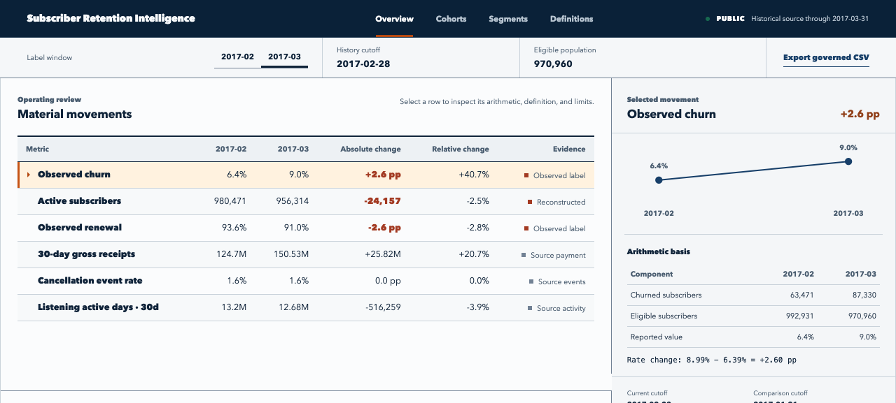
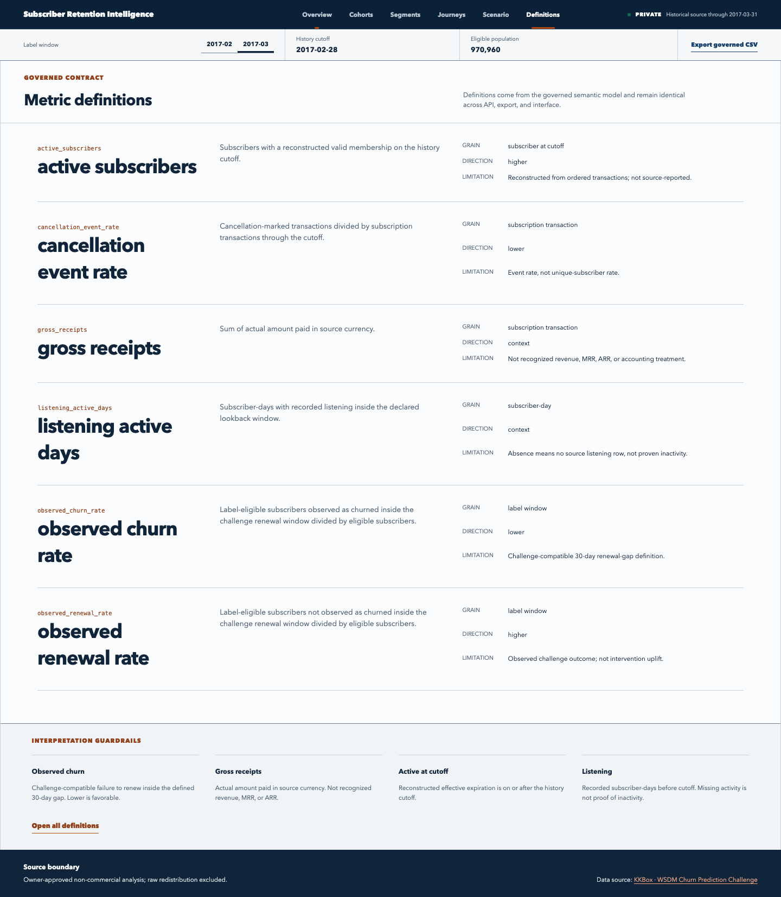
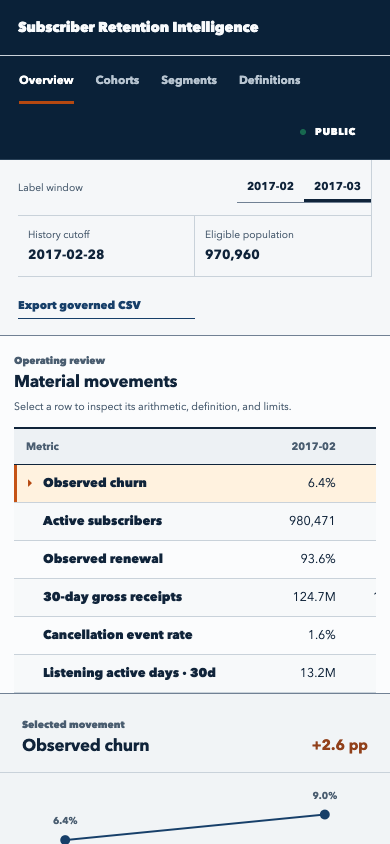
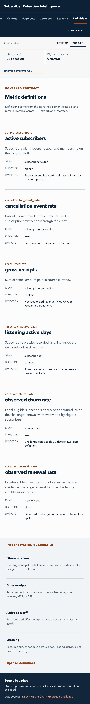

# Subscriber Retention Intelligence

Consumer subscription-retention analysis over 442,211,685 accepted membership, payment, listening, and churn-label rows.



## What it does

- Reconstructs subscriber state from detailed subscription transactions.
- Analyzes active subscribers, gross receipts, renewals, cancellations, churn, cohorts, and daily listening engagement.
- Builds cutoff-safe subscriber snapshots and features.
- Compares a logistic churn baseline with a calibrated nonlinear challenger.
- Connects risk thresholds and contact capacity to explicitly assumed intervention economics.
- Publishes the complete transformed row-level corpus alongside the privacy-reviewed analysis product.

## Architecture

Compressed source archives stream directly into typed partitioned Parquet. DuckDB and dbt Core build subscriber, transaction, listening, snapshot, feature, cohort, and metric models. Governed marts feed the local and public web products. Cloudflare Pages serves the static analysis surface, and Hugging Face serves the complete transformed Parquet release.

See the [architecture](docs/architecture.md) and [case study](docs/case-study.md).

## Evaluation

Source reconciliation, subscription-state reconstruction, metric accuracy, time leakage, model log loss, calibration, lift at capacity, scenario arithmetic, query latency, accessibility, privacy, and release inventory have explicit gates.

The calibrated challenger is supported for 881,701 repeat subscribers in the untouched March window. It improves log loss by 5.57 percent over the logistic baseline, has expected calibration error of 0.0166, and produces 4.95 top-decile lift. Probability use is blocked for 89,259 March-new subscribers.

## Limits

- The source represents a consumer music subscription, not enterprise SaaS.
- Payment amounts are gross receipts, not GAAP or recognized revenue.
- Active status, renewal, and expiration are reconstructed from transactions.
- No observed outreach, offer, or causal treatment outcome exists.
- No account hierarchy, seats, contracts, CSM ownership, or support cases exist.

## Scaling

Local mode preserves detailed subscriber-day and subscription-transaction facts while cohort and monthly marts accelerate decisions. Permanent public delivery keeps request-time compute at zero: the dashboard uses governed static extracts and the complete transformed corpus is distributed as partitioned Parquet. Fabric and actual Power BI engine execution were closed unrun to preserve the zero-additional-cost constraint.

## Status

The analysis product is live at [subscriber-retention-intelligence.pages.dev](https://subscriber-retention-intelligence.pages.dev/). It uses a static, privacy-reviewed snapshot with no server function or request-time access to private facts. All 442,211,685 transformed accepted rows are published through the [Hugging Face dataset](https://huggingface.co/datasets/vaibhavkhurana/subscriber-retention-intelligence). The evidence-backed [portfolio case study](https://portfolio-reeper1.vercel.app/projects/subscriber-retention-intelligence) records the decision context, architecture, evaluation, tradeoffs, and limitations. Detailed private journeys and the intervention scenario remain local-only. Power BI engine execution remains unverified.

See the [release contract](docs/release-contract.md), [BI semantic contract](powerbi/semantic-contract.json), [source contract](docs/data-contract.md), and [detailed fact pipeline](docs/fact-pipeline.md).

## Product evidence

The stakeholder view opens on material movement rows, exact selected-metric arithmetic, matched cohort breaks, and comparable descriptive segment cuts. The technical view exposes metric definitions, freshness, attribution, and limitations. Both were verified at 1440 px and 390 px with no page-level horizontal overflow.

| Stakeholder | Technical |
| --- | --- |
|  |  |
|  |  |

The screens use sanitized aggregate data only. The public repository contains no source archive, private token, publication salt, private warehouse, or model artifact. The separately hosted Parquet release uses release-specific keys and generalized member attributes.

Set `RETENTION_PRIVATE_DIR` to private storage outside this repository. Build and reconcile the semantic warehouse without Docker:

```sh
.venv/bin/python scripts/build_semantics.py
.venv/bin/python scripts/reconcile_semantics.py \
  --warehouse "$RETENTION_PRIVATE_DIR/warehouse/retention.duckdb" \
  --facts "$RETENTION_PRIVATE_DIR/facts"
```

See [governed semantic model](docs/semantic-model.md).

Build and serve the descriptive product without Docker:

```sh
cd web
npm ci
npm run build
cd ..
.venv/bin/uvicorn retention_api.main:app --host 127.0.0.1 --port 8000 --workers 1
```

See [descriptive retention product](docs/descriptive-product.md).

Build the aggregate dashboard release with one local DuckDB thread:

```sh
.venv/bin/python scripts/build_static_public_release.py --release-id public-m9r
cd web
VITE_RETENTION_STATIC_PUBLIC=1 npm run build
```

See [public deployment](docs/deployment.md).

Build and verify the complete row-level Parquet release with one DuckDB thread and a 4 GiB memory limit:

```sh
.venv/bin/python scripts/build_detailed_public_release.py \
  --facts /path/to/private/facts \
  --output /path/to/private/public-release/public-m12 \
  --salt-file /path/to/private/publication/public-token-salt
.venv/bin/python scripts/verify_detailed_public_release.py \
  --facts /path/to/private/facts \
  --release /path/to/private/public-release/public-m12 \
  --salt-file /path/to/private/publication/public-token-salt
```

Browse or download the verified release from the [Hugging Face dataset](https://huggingface.co/datasets/vaibhavkhurana/subscriber-retention-intelligence). See [row-level data release](docs/full-data-release.md).

Evaluate the fixed churn baseline and challenger with one local thread:

```sh
.venv/bin/python scripts/evaluate_churn_models.py
```

See [calibrated churn model](docs/churn-model.md).

Build and verify the bounded private scenario curve:

```sh
.venv/bin/python scripts/build_scenario_curve.py
.venv/bin/python scripts/verify_scenario.py
```

See [bounded intervention scenario planner](docs/scenario-planner.md).

Run the local release checks against the deterministic aggregate fixture:

```sh
.venv/bin/python scripts/build_release_fixture.py --output /tmp/retention-release.duckdb
.venv/bin/python scripts/verify_power_bi_contract.py \
  --warehouse /tmp/retention-release.duckdb
.venv/bin/python -m unittest discover -s tests
cd web
npm ci
npm run lint
npm run build
npm test
```

The Power BI DAX and relationship contract is reconciled locally. Actual Power BI engine reconciliation remains unverified until an approved browser-authored run exports the fixed-context controls.

## Source verification

Install `requirements.txt`, then run the profiler against the owner-obtained archive directory. It validates headers and row controls while streaming seven private Zstandard Parquet pilots without retaining expanded CSV.
Set `RETENTION_EVIDENCE_DIR` to private storage outside this repository before writing delivery evidence.

```sh
python3 scripts/profile_sources.py \
  --source-dir "$SOURCE_ARCHIVE_DIR" \
  --output "$RETENTION_EVIDENCE_DIR/m2-source-manifest.json" \
  --pilot-dir "$RETENTION_PRIVATE_DIR/m2-pilot"
```

Build private detailed facts after source verification:

```sh
python3 scripts/build_facts.py \
  --source-dir "$SOURCE_ARCHIVE_DIR" \
  --output-dir "$RETENTION_PRIVATE_DIR/facts" \
  --report "$RETENTION_EVIDENCE_DIR/m3-ingestion-run.json"
```

## Source and license

The analytical source is the KKBox Churn Prediction Challenge dataset, distributed through Kaggle under the source provider's terms. See the machine-readable attribution in the API status response and the [data contract](docs/data-contract.md). The owner approved this transformed detailed release. Source archives and identifiers remain excluded, and provider-owned data is not relicensed.

Repository code and documentation are available under the [MIT License](LICENSE). The license does not apply to source data, the public detailed dataset, private derived data, or provider-owned materials.
